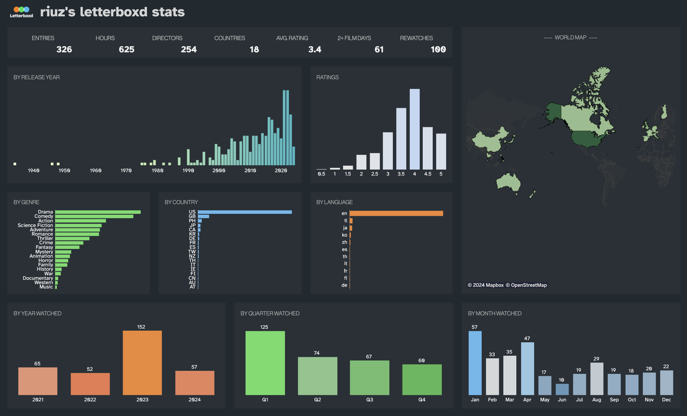

# Letterboxd Data Analysis Project

## Project Objectives | Business Questions

- What are some trends in my movie-watching habits?
    - Specifically rewatch patterns, genres, cast & crew, and release/watch dates.
- Have I been generally watching movies that I end up rating highly?
- Based on highly-rated attributes, what movies should I watch next?

## Summary of Insights

Low-level findings

### Targeted Genre Exploration:

- **Discovery:** While Drama, Comedy, Action, Science Fiction, Adventure, Romance, Thriller, and Crime dominate my viewing habits, I've developed a higher appreciation for less-watched genres like Music, War, History, and Mystery.
- **Action:** Intentionally seek out and watch more films from these underrepresented genres to diversify my cinematic experience and potentially discover new favorites.

### Director and Actor Emphasis:

- **Discovery:** Quentin Tarantino, and Denis Villeneuve are the most watched directors. Samuel L. Jackson, Brad Pitt, J.K. Simmons, Chris Pratt, Scarlett Johansson, and Willem Dafoe are the most watched actors.
- **Action:** Explore more films by directors with a distinct style, especially those I enjoy but haven’t watched much. Also, consider watching more films featuring under-appreciated actors who have positively surprised me.

### Support for Local Cinema:

- **Discovery:** There's a predominance of US-origin films in my watch history. Making up 85.58% of the entries, while PH-origin movies are only about 3.68%.
- **Action:** Actively seek out films produced in the Philippines to balance my viewing habits and support local industry growth.

### Viewing Habits and Trends:

- There was a huge spike in movie-watching during 2023 because of a more conscious effort to watch more films. The most-watched months are January and April. With release dates, it's clear that I watched more movies released in the last two decades.

### Rewatch Strategy:

- My ratings generally increase on rewatch, particularly for films initially rated above 3 stars, while some like “Train to Busan” rated lower. This insight is complemented by the finding that movies with initially high ratings are more likely to be rewatched and often maintain or improve in ratings.

### High-Rating Patterns:

- High ratings are often given to genres like Music, War, History, Mystery, Family, and Drama; directors like Christopher Nolan, Richard Linklater, Richard Curtis, Luca Guadagnino, and Denis Villeneuve have at least two watched-moves that were highly rated; actors like Michael Stuhlbarg, Ethan Hawke, Jake Gyllenhaal, Dave Bautista, Linda Cardellini, Kyle Bornheimer, Haruka Abe, Tom Stourton, Julie Delpy, Angela Bassett, and Domhnall Gleeson are highly rated.

## Recommendations and Next Steps

- Continue the momentum of watching more films and make sure to make a conscious decision of it. Also, consider exploring older movies to appreciate the evolution of cinema.

- Implement a strategy to rewatch films I rated lower than 3 stars to see if my perceptions change over time, providing deeper insights into my rating patterns and preferences. Maybe even surfacing new favorites that I initially overlooked.

- Dive into movies with these specific highly-rated attributes to see if my interest aligns with these high ratings. If not, I could normalize my data to provide a deeper understanding of my preferences.

<i>Just for fun, I plugged these highly-rated attributes into ChatGPT and these are 15 movies it told me to watch next.</i>

🤠: Recommend me 15 movies that meet these attributes. At least 3 of the attributes should be met.

High ratings are often given to genres like Music, War, History, Mystery, Family, and Drama; directors like Christopher Nolan, Richard Linklater, Richard Curtis, Luca Guadagnino, and Denis Villeneuve have at least two watched-moves that were highly rated; actors like Michael Stuhlbarg, Ethan Hawke, Jake Gyllenhaal, Dave Bautista, Linda Cardellini, Kyle Bornheimer, Haruka Abe, Tom Stourton, Julie Delpy, Angela Bassett, and Domhnall Gleeson are highly rated. 

For each movie, pinpoint the attribute/s that were met. Feel free to scour for movies that overlap in genre, directors, or actors.

---

🤖: 
Here's a curated list of 15 movies that meet your criteria, each featuring a combination of the genres, directors, or actors you prefer:

1. **Dunkirk (2017)** - Directed by Christopher Nolan. Genres: War, History, Drama. This film covers multiple attributes with its acclaimed direction by Nolan and its intense portrayal of war.

2. **Arrival (2016)** - Directed by Denis Villeneuve. Genres: Mystery, Drama. This sci-fi mystery features a compelling narrative directed by Villeneuve.

3. **Sicario (2015)** - Directed by Denis Villeneuve. Genre: Mystery. Another intense and highly-rated film directed by Villeneuve, known for its gripping storyline and mystery elements.

4. **Interstellar (2014)** - Directed by Christopher Nolan. Genre: Drama. Nolan's directorial brilliance shines in this dramatic space exploration epic.

5. **Call Me by Your Name (2017)** - Directed by Luca Guadagnino. Genre: Drama, Family. This romantic drama highlights Guadagnino's sensitive direction and explores deep emotional and family themes.

6. **Before Sunset (2004)** - Directed by Richard Linklater. Genre: Drama. Featuring Ethan Hawke, this film excels in its dramatic portrayal of a romantic encounter, directed by Linklater.

7. **Boyhood (2014)** - Directed by Richard Linklater. Genre: Drama, Family. Another Linklater classic, known for its unique filming over many years, capturing family and drama.

8. **Prisoners (2013)** - Directed by Denis Villeneuve. Genre: Mystery, Drama. This film features Jake Gyllenhaal and showcases Villeneuve's mastery in creating a tense mystery drama.

9. **Atonement (2007)** - Genre: Drama, War, History. While not directed by one of your listed directors, this film fits well within the highly-rated war, history, and drama genres.

10. **The Theory of Everything (2014)** - Genre: Drama, Family. Focusing on the life of Stephen Hawking, this film captures deep family and dramatic elements.

11. **Blade Runner 2049 (2017)** - Directed by Denis Villeneuve. Genre: Mystery, Drama. Featuring Dave Bautista and directed by Villeneuve, this sequel brings together mystery and drama in a visually stunning way.

12. **Nightcrawler (2014)** - Genre: Mystery, Drama. Featuring Jake Gyllenhaal, this film delivers an intense mystery and dramatic narrative.

13. **Love Actually (2003)** - Directed by Richard Curtis. Genre: Drama, Family. A classic romantic drama that's highly acclaimed for its ensemble cast and Curtis's engaging storytelling.

14. **Green Book (2018)** - Genre: Drama, Family, History. While not directly meeting the director or specific actor criteria, it excellently captures the essence of family, drama, and historical themes.

15. **Mudbound (2017)** - Genre: Drama, History, War. This film delves deeply into historical and war themes with a dramatic narrative, fitting your genre preferences well.

Each movie listed meets at least three of the specified attributes, whether through its genre, director, or featured actors.

-- Fun fact: I've watched 7/15 films! Time to watch the rest ;)

## General Information

To gather and enrich the data, I exported my data from Letterboxd then used Python to request additional data from the TMDb API. The data was then cleaned, processed, and explored in Python (some cleaning were made in Excel as well), before being visualized in Tableau.

Check out the [Letterboxd All-Time Stats - Tableau Workbook](https://public.tableau.com/views/LetterboxdAll-TimeStats/Summary).

For more about my projects and data journey, visit my [Portfolio](https://www.notion.so/ruizdelcarmen/Ruiz-del-Carmen-Data-Portfolio-e725748d0e0546c386be6c6c7dc49099).
